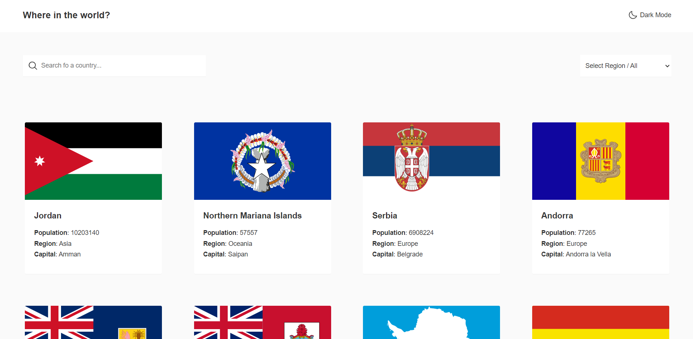
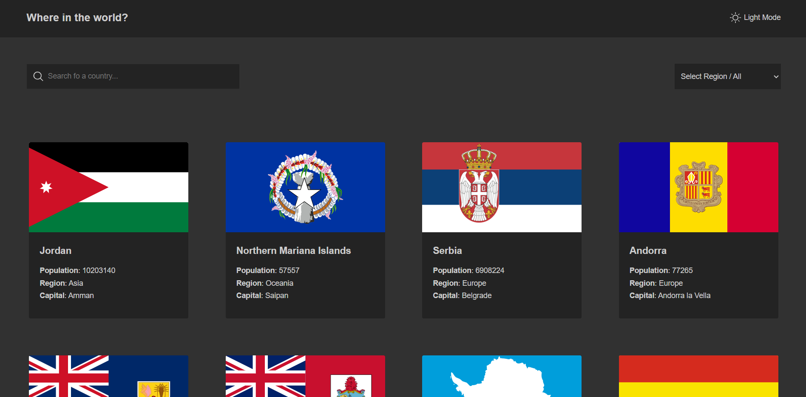

# Where in the world

This project is about REST Countries API with color theme switcher, using React & SCSS

## Table of contents

- [Overview](#overview)
  - [Features](#the-challenge)
  - [Screenshot](#screenshot)
  - [Links](#links)
- [My process](#my-process)
  - [Built with](#built-with)
  - [Continued development](#continued-development)
- [Author](#author)

## Overview

### Features

Users will be able to:

- See all countries from the API on the homepage
- Search for a country using an `input` field
- Filter countries by region
- Toggle the color scheme between light and dark mode

### Screenshot

### Links

- Live on: [Netlify](https://todayilearned-parham.netlify.app/)

## My process

### Built with

- React.js
- SCSS
- [REST Countries API](https://restcountries.com)

### Continued development

Some features and improvments that will be added to the Where in the world app:

- Click on a country to see more detailed information on a separate page
- Click through to the border countries on the detail page

## Author

- Linkedin - [@parham-tavakolian](https://www.linkedin.com/in/parham-tavakolian/)
